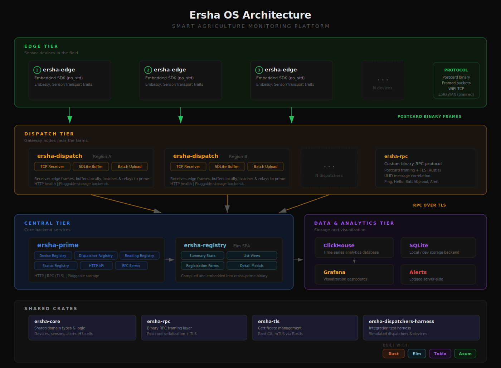

# ersha-os

**Open-source Digital Public Infrastructure (DPI) for Smart Agriculture Monitoring**

A platform that helps governments, cooperatives, and farmers monitor farms in real time. It connects low-power sensor devices in the field to a central backend through regional gateways, with a web dashboard for device management and monitoring.

*Built to scale to nations.*

---

## Key Features

- Resilient **sensor monitoring** (soil moisture, soil temperature, air temperature, humidity, rainfall)
- **Pluggable storage backends** — in-memory, SQLite, and ClickHouse
- **Web dashboard** for device and dispatcher management
- **Mutual TLS** between all components via a custom binary RPC protocol
- **H3 geospatial indexing** for device and dispatcher locations
- Scalable: single farm → regional → national deployment
- Fully open-source and hardware-agnostic

## Architecture



The platform has three tiers:

1. **Edge** — Sensor devices running `ersha-edge` on bare-metal MCUs collect readings and send them as compact Postcard-encoded binary frames over TCP.
2. **Dispatch** — Regional gateways running `ersha-dispatch` receive sensor data, buffer it locally (SQLite), and batch-upload to the central backend over a custom RPC implementation in `ersha-rpc` secured via TLS.
3. **Central** — `ersha-prime` stores device/dispatcher registries and sensor readings, exposes an HTTP API and web dashboard for managing the device/dispatcher registry, stores device statuses and sensor readings in ClickHouse for further analysis.

ClickHouse is used for time-series analytics in production, with Grafana for visualization.

## Workspace Overview

```
ersha-os
├── ersha-core                  # Shared domain types and logic
├── ersha-rpc                   # Binary RPC framing layer with TLS
├── ersha-edge                  # Embedded SDK for sensor devices (no_std)
├── ersha-dispatch              # Ingestion gateway service
├── ersha-prime                 # Core backend & device registry
├── ersha-tls                   # TLS certificate generation & management
├── ersha-registry              # Elm web dashboard (SPA)
└── ersha-dispatchers-harness   # Integration test harness
```

---

## Crates

### [`ersha-core`](ersha-core)

Shared domain types used across all crates.

- Device, dispatcher, and sensor models with ULID identifiers
- Sensor metric types: soil moisture, soil/air temperature, humidity, rainfall
- Alert system with severity levels (Critical, Warning, Info) and typed alert categories
- H3 geospatial cell types for location indexing
- Batch upload request/response structures

See [`ersha-core/README.md`](ersha-core/README.md) for details.

---

### [`ersha-rpc`](ersha-rpc)

Transport-agnostic binary RPC layer.

- Postcard serialization with length-delimited framing
- Client/server abstractions with request/response correlation via ULID message IDs
- TLS support through `ersha-tls` (Rustls)

See [`ersha-rpc/README.md`](ersha-rpc/README.md) for details.

---

### [`ersha-edge`](ersha-edge)

Embedded SDK for sensor devices. `#![no_std]` compatible.

- Async-first design using the Embassy runtime
- `Sensor` trait — implement `read()` and `sampling_rate()`, the framework handles the rest
- `Transport` trait — abstracts the network layer (WiFi TCP implemented)
- Engine orchestrates sensor collection and upload
- Sensor macro for automatic Embassy task generation

See [`ersha-edge/README.md`](ersha-edge/README.md) for details.

*Initial implementation — we have mostly relied on mocking instead of software running on actual MCUs*

---

### [`ersha-dispatch`](ersha-dispatch)

Regional ingestion gateway that sits between edge devices and the central backend.

- **Edge receivers:** TCP and a mock for testing
- **Storage backends:** in-memory and SQLite
- Buffers sensor readings and device status locally
- Batches and uploads to `ersha-prime` via RPC over TLS
- Generates alerts for critical battery levels and sensor failures
- HTTP health endpoint for monitoring

See [`ersha-dispatch/README.md`](ersha-dispatch/README.md) for details.

---

### [`ersha-prime`](ersha-prime)

Central backend service.

- **Registries:** Device, Dispatcher, Reading, and DeviceStatus — each with in-memory, SQLite, and ClickHouse implementations
- **HTTP API** for device and dispatcher registration, listing, and management
- **RPC server** (port 9000, mTLS) — handles dispatcher hello, batch upload, alerts, status, and disconnection
- Serves the Elm registry UI as an embedded SPA

See [`ersha-prime/README.md`](ersha-prime/README.md) for details.

---

### [`ersha-tls`](ersha-tls)

TLS certificate generation and management.

- Generates a local root CA
- Creates and signs server/client certificates
- Integrates with Rustls for mutual TLS across all services

See [`ersha-tls/README.md`](ersha-tls/README.md) for details.

---

### [`ersha-registry`](ersha-registry)

Elm single-page application for device and dispatcher management.

- Dashboard with summary stats (total devices, active dispatchers, system health)
- Device and dispatcher list views
- Registration forms for devices (with sensor configuration) and dispatchers
- Detail modals for individual devices and dispatchers
- Compiled and embedded into the `ersha-prime` binary

---

### [`ersha-dispatchers-harness`](ersha-dispatchers-harness)

Integration test and simulation harness.

- Spawns multiple dispatcher processes against a running `ersha-prime`
- Generates realistic sensor data and device status updates
- Uses H3 cells across Ethiopia for dispatcher locations
- Configurable reading/status intervals and device counts

See [`ersha-dispatchers-harness/README.md`](ersha-dispatchers-harness/README.md) for details.

---

## Quick Start

```sh
just docker-bootstrap
```

This generates TLS certificates, builds the Docker images, and starts the full stack:

| Service | Port | Description |
|---------|------|-------------|
| `ersha-prime` | 8080 (HTTP), 9000 (RPC) | Backend + web dashboard |
| `clickhouse` | 8123, 9000 | Time-series storage |
| `ersha-harness` | — | Simulated dispatchers and devices |
| `grafana` | 3000 | Visualization dashboards |

Open `http://localhost:8080` for the registry dashboard.

## Development

The project uses [Nix](https://nixos.org/) for development environment management:

```sh
nix develop
```

This provides Rust (stable), Elm, Node.js, and all required tooling.

## Roadmap

The following features are planned but not yet implemented:

- **LoRaWAN transport** — the `Transport` trait is designed for this, but only WiFi/TCP exists today
- **Alert delivery** — SMS, Telegram, and WhatsApp notification channels (alerts are currently logged server-side)
- **Hardware reference designs** — reference implementations for specific sensor boards

---

## License

Licensed under the terms of the MIT License. See [`LICENSE`](LICENSE) for details.
